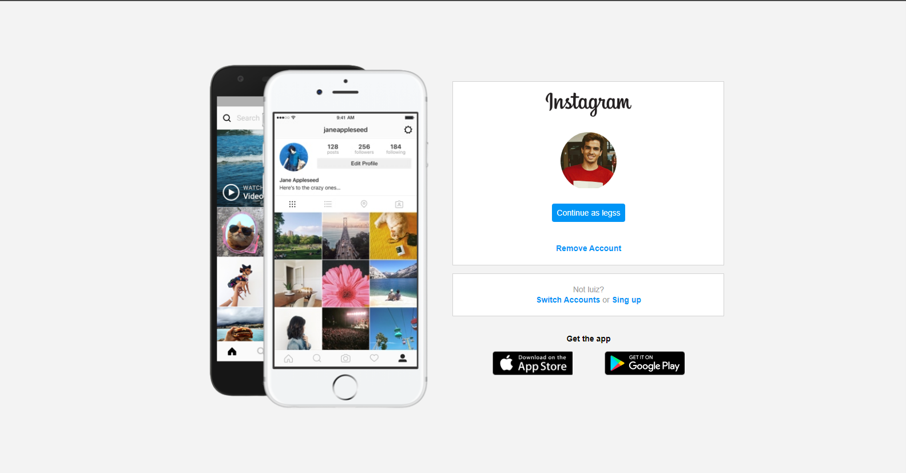

# Treinamento - Login Instagram - Dia 5

Este mini-projeto, faz parte do meu treinamento para aprender os fundamentos para ser desenvolvedor Front-end.

## Sumário

- [Visão Geral](#resumo)
  - [O desafio](#o-desafio)
  - [Screenshot](#screenshot)
  - [Live Site](#live-site)
- [Processo de criação](#processo-de-crição)
  - [O que foi usado?](#o-que-foi-usado?)
  - [O que eu aprendi](#o-que-eu-aprendi)
  - [Para os proximos projetos](#para-os-proximos-projetos)
  - [Recursos utilizados](#recursos-utilizados)
- [Author](#author)

## Visão Geral

### O desafio

Este projeto é resultado do BootCamp HTML Web Developer, disponibilizado no site da [Digital Innovation One](https://digitalinnovation.one/)

### Screenshot

### Live Site

Caso quiser ver como ficou o mini-projeto, eu postei [aqui]()

## Processo de criação

### O que foi usado?

- HTML
- CSS

### O que eu aprendi

Neste mini-projeto, tive um pouco de dificuldade para colocar a semântica no HTML, a qual eu ainda fico um pouco confuso sobre qual é a tag correta a se utilizar.

No CSS, aprendi mais métodos para utilizar quando for resetar o CSS, aprendi sobre a utilização de pseudo-classes, como a nth-child(), a qual facilitou muito no tempo e organização da construção.

Ao final, consegui colocar mais em pratica a responsividade, pegando referências e testando cada categoria de celulares disponíveis no Chrome.

### Para os proximos projetos

Com este projeto, ja me sinto mais confiante para começar a aprender JavaScript e aplicar em futuros projetos.

### Recursos utilizados

- https://www.w3schools.com/ - Utilizei bastante os recursos da W3School para relembrar de tags ou valores para finalizar o projeto.

- https://www.instagram.com/ - Utilizei a pagina do próprio instagram, para tirar algumas referências.

## Author

- Linkedin - [Luiz Eduardo](https://www.linkedin.com/in/luiz-eduardo-13901b224)
